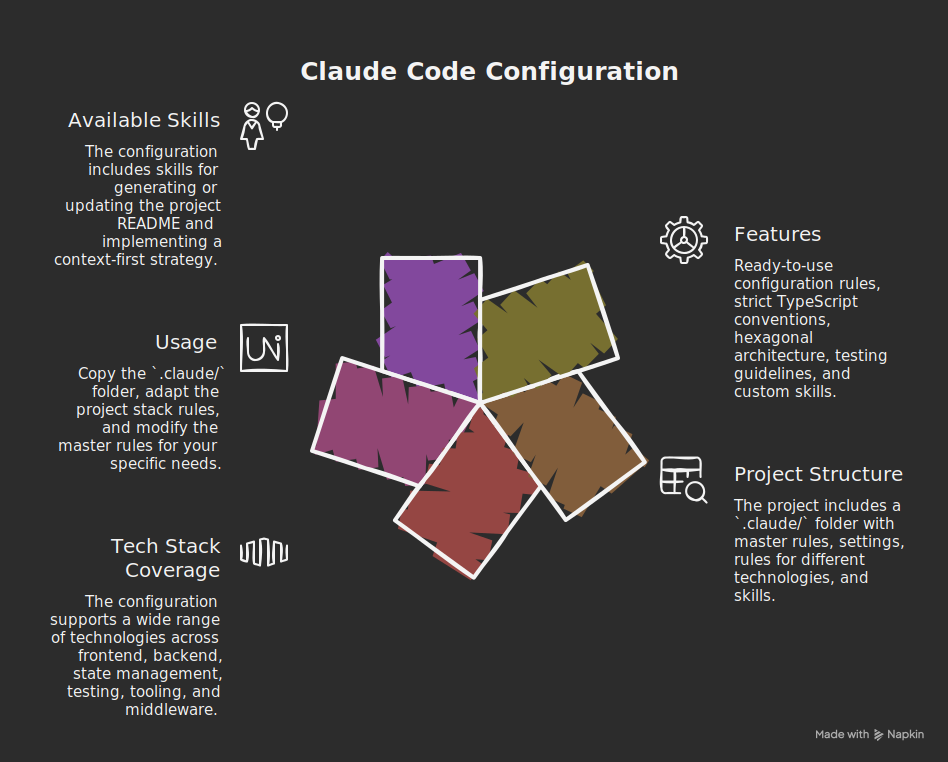

<div align="center">
  
</div>

- [Claude Code Workflow](#claude-code-workflow)
  - [Features](#features)
  - [Structure du projet](#structure-du-projet)
  - [Stack technique couvert](#stack-technique-couvert)
  - [Utilisation](#utilisation)
  - [Skills disponibles](#skills-disponibles)
  - [Plugins activés](#plugins-activés)

# Claude Code Workflow

Configuration et conventions pour optimiser l'utilisation de Claude Code sur des projets TypeScript/React.

## Features

- Règles de configuration Claude Code prêtes à l'emploi
- Conventions TypeScript strictes avec patterns recommandés
- Architecture hexagonale pour applications React
- Guidelines de test avec Testing Library
- Skills personnalisés (readme, context-first)

## Structure du projet

```
.claude/
├── CLAUDE.md              # Règles maîtresses
├── settings.json          # Configuration Claude Code
├── rules/
│   ├── project-stack.md   # Stack technique supporté
│   ├── react/
│   │   ├── component-patterns.md
│   │   └── hexagonal-architecture.md
│   └── typescript/
│       ├── testing-guidelines.md
│       └── typescript-conventions.md
└── skills/
    ├── readme/            # Génération de README
    └── context-first/     # Stratégie d'implémentation contextuelle
```

## Stack technique couvert

| Catégorie  | Technologies                                              |
| ---------- | --------------------------------------------------------- |
| Frontend   | React, Next.js, Vite, TypeScript, Tailwind CSS, ShadCN UI |
| Backend    | Node.js, Fastify, Express, NestJS, Supabase               |
| State      | Zustand, TanStack Query, React Context                    |
| Testing    | Vitest, Jest, React Testing Library                       |
| Tooling    | ESLint, Prettier, pnpm, Docker                            |
| Middleware | Auth0, Stripe                                             |

## Utilisation

1. Copier le dossier `.claude/` à la racine de votre projet
2. Adapter `rules/project-stack.md` selon votre stack
3. Modifier `CLAUDE.md` pour vos règles spécifiques

## Skills disponibles

| Skill            | Description                                                |
| ---------------- | ---------------------------------------------------------- |
| `/readme`        | Génère ou met à jour le README.md du projet                |
| `/context-first` | Implémentation contextuelle basée sur les fichiers fournis |

## Plugins activés

- `frontend-design` - Interfaces frontend production-grade
- `feature-dev` - Développement guidé de fonctionnalités
- `code-simplifier` - Simplification et refactoring
- `typescript-lsp` - Support LSP TypeScript
- `pyright-lsp` - Support LSP Python
